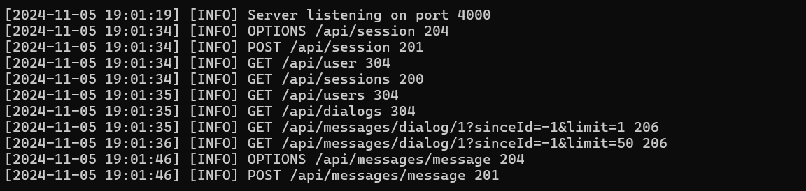

# messenger-server



## Available scripts

In the project directory, you can run:

- `npm start` - runs the server in the development mode
- `npm run build` - builds the server for production to the `build` folder

## Config

The configuration file `config.json` is read from the server's startup directory.

Options:

- `server`
  - `port` - server port
- `database`
  - `user` - database user
  - `password` - database password
  - `host` - database host
  - `port` - database port
  - `database` - database name

Example:

```json
{
  "server": {
    "port": 4000
  },
  "database": {
    "user": "messenger",
    "password": "password",
    "host": "localhost",
    "port": 5432,
    "database": "messenger"
  }
}
```

## Command line options

- `-v`, `--version` - print version
- `-h`, `--help` - print command line options

## Database

- Database scripts: [database.sql](./docs/database.sql)

## API

- API description: [api.md](./docs/api.md)
- Postman collection: [api.json](./docs/api.json)

## Requirements

- Node.js: 20.12.2
- PostgreSQL: 14.0

## License

[MIT](./LICENSE)
